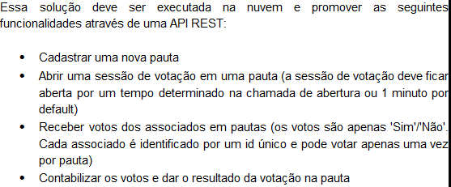
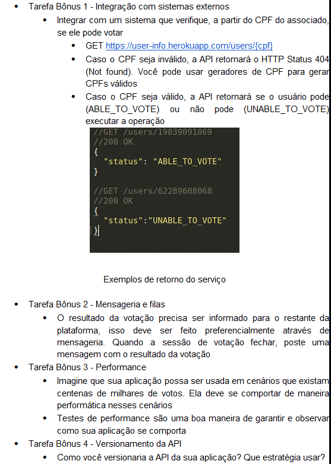
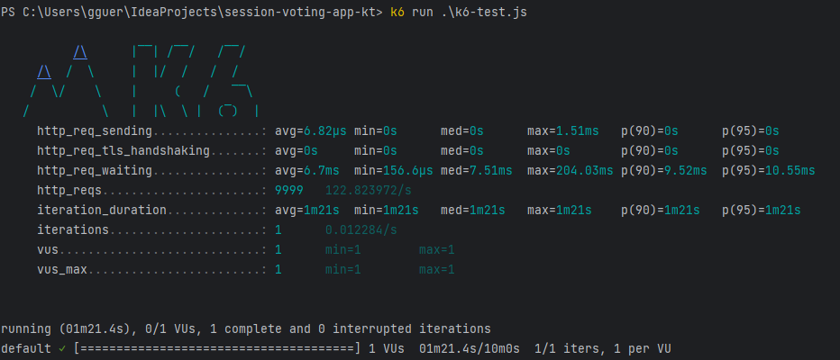

# session-voting-app-kt

API RESTful para gerenciamento de votações em pautas. Desenvolvida com Kotlin e Spring Boot.

## Execução da solução

É necessário ter os seguintes softwares instalados:

- JDK 17
- docker e docker-compose (ou podman)

Execução dos testes automatizados

```shell
./gradlew test
```

Iniciar a infraestrutura necessária

```shell
docker-compose up -d
```

Execução da aplicação

```shell
./gradlew bootRun
```

## Especificações técnicas



## Tarefas bônus



## Apresentação da solução

A aplicação foi desenvolvida em Kotlin, utilizando o framework Spring Boot. A escolha foi feita devido ao conhecimento
do desenvolvedor na tecnologia, e pelo interesse em continuar a explorar a linguagem Kotlin.

O foco foi em atender de maneira simples e eficiente os requisitos solicitados, bem como implementar as tarefas bonus.

Não foi criada uma entidade para o usuário / associado, pois se entende que o gerenciamento dessa entidade seria feito
em outro microsserviço. Assim, usa-se apenas o ID do mesmo.

Em relação às sessões de uma pauta, pensou-se em uma solução para possibilitar múltiplas sessões para uma pauta, porém, apenas uma sessão aberta por vez.
Isso pode ser alterado facilmente caso necessário.

A API também utiliza banco de dados PostgreSQL e mensageria com RabbitMQ, orquestrado pelo docker-compose.

Em termos de arquitetura, foi utilizada uma arquitetura em camadas convencional, a fim de manter a simplicidade e para
melhor aproveitar o tempo de desenvolvimento.

### Escolhas técnicas

Além da experiência do desenvolvedor, a popularidade da stack Spring Boot + Kotlin / Java foi um fator crucial para a
escolha das tecnologias.

Em termos de desempenho, foi utilizada a abordagem clássica de "_one thread per request_". Entretanto, caso a demanda de
requisições concorrentes seja muito grande, pode-se adotar o uso de tecnologias como Webflux, em conjunto das Coroutines
do Kotlin para facilitar o uso e desenvolvimento.

Foi também adicionado o módulo de actuator do Spring para adicionar funcionalidades para produção.

O banco de dados PostgreSQL foi selecionado pela natureza relacionada dos dados do domínio. RabbitMQ foi escolhido pelo
uso prévio por parte do desenvolvedor.

Tentou-se deixar a cobertura de testes com o maior valor possível.

### Tarefas bônus

Em relação às atividades bônus, vale ressaltar alguns pontos:

- A tarefa 1 foi implementada, porém, a API fornecida não estava online. Assim, foi desenvolvida a lógica para a
  validação. Porém, a mesma pode ser habilitada ou desabilitada no arquivo de configuração **application.yml**. Por
  padrão, está desabilitado.
- Para a tarefa 3, foi implementado um _script_ simples para a ferramenta k6, para testar a carga no endpoint.
  de votação.
- Sobre a tarefa 4, além da documentação com Swagger, foi utilizada a lógica de versionamento por prefixo na URl. A
  versão atual é **v1**, assim, os endpoints ficam: **/api/v1/...**

Foram incluídas imagens dos resultados das métricas do k6, na pasta images. Exemplo:



Além disso, na pasta profiler, foi colocado um snapshot jfr registrado ao executar o k6.